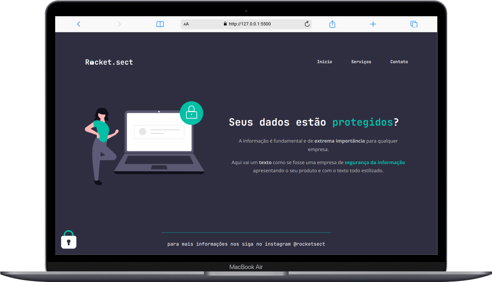

<h1 align="center">Explorer - Desafio do Projeto 2</h1>
 

     <a href="#-tecnologias">Tecnologias</a> •    
     

 

Segundo desafio criado no curso Explorer da Rocketseat.

Foi aplicado os conceitos fundamentais de HTML e CSS, são eles:

- Estruturando um projeto HTML;
- Uso de tags HTML mais comuns;
- Conceitos iniciais de CSS;
- Posicionamento e alinhamento de elementos na tela;
- Aplicando fontes customizadas;
- Trabalhando com acessibilidade;
- Espaçamentos.

 

## 🌄 Layout

 

 

## 🛠 Tecnologias

Abaixo tecnologias que foram usadas no projeto:

- Html
- Css

 

## 👨‍💻 Colaboradores

<table>
    <tr>
         <td align="center"><a href="https://brunogoncalvesferreira.com"> <b>Bruno Gonçalves</b></a> <a href="https://brunogoncalvesferreira.com" title="Bruno Gonçalves Ferreira">👨‍🚀</a></td>
    </tr>
</table>
